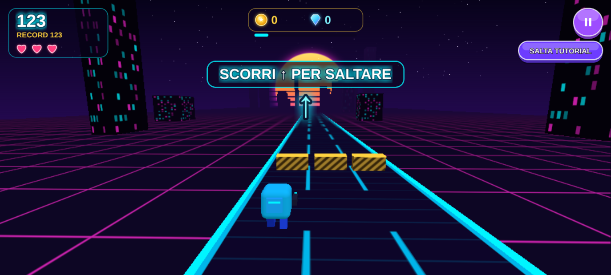
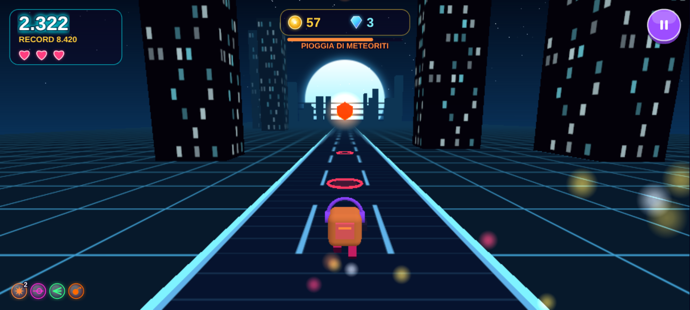
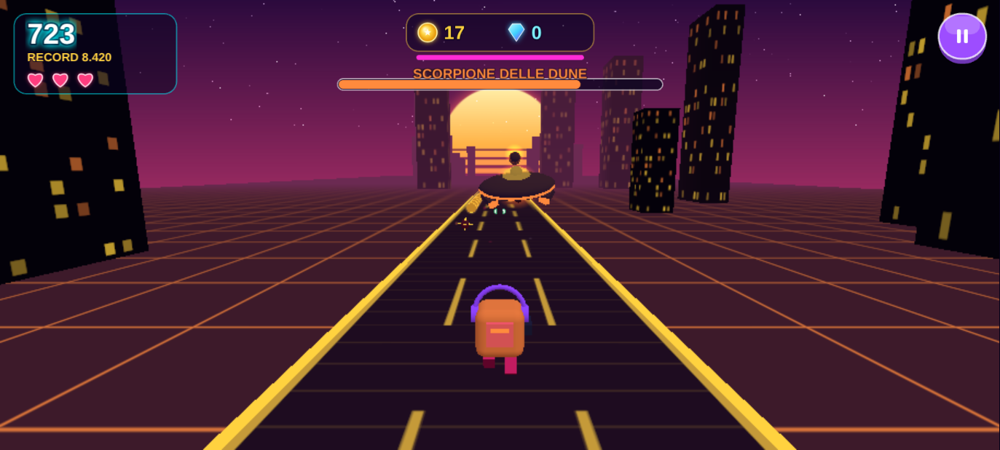
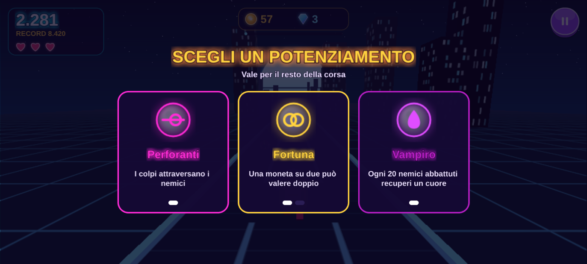
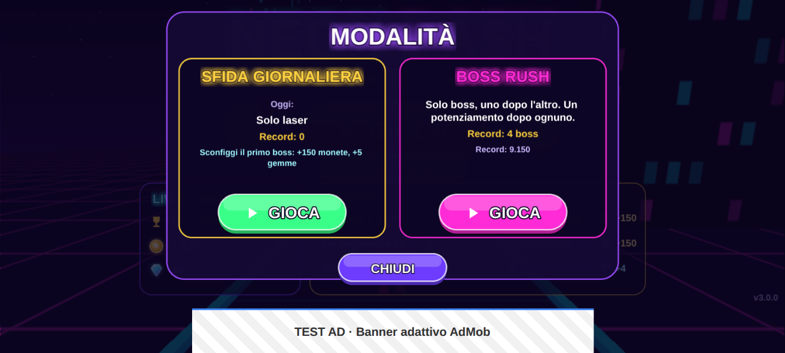
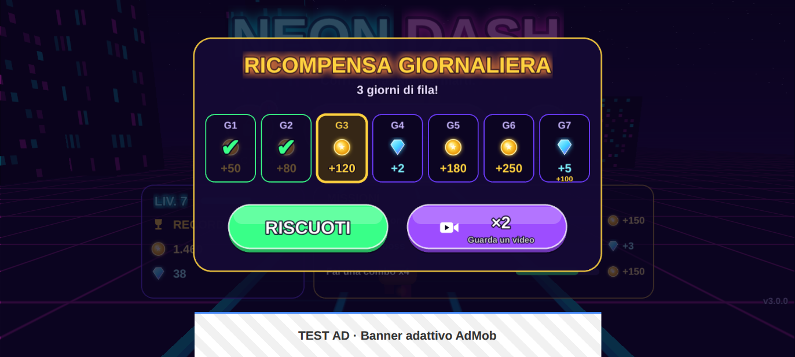

# Neon Dash

Runner sparatutto **3D** in stile synthwave per Android. Il mondo 3D è disegnato con **Three.js**, l'interfaccia con **Phaser 3**; il gioco è confezionato con **Capacitor 8** e monetizzato con **Google AdMob** (`@capacitor-community/admob`).
Modelli 3D, texture, effetti sonori e colonna sonora sono generati proceduralmente (geometrie Three.js, Canvas 2D e Web Audio): il gioco non dipende da alcun file di asset esterno.

| Menu | Tutorial | Gioco |
| --- | --- | --- |
|  |  |  |
| **Pioggia di meteoriti** | **Boss (Scorpione delle dune)** | **Scelta del potenziamento** |
|  |  |  |
| **Modalità** | **Negozio** | **Ricompensa giornaliera** |
|  |  |  |
| **Game Over** | **Impostazioni** | |
|  |  | |

## Scelte di progetto

| Parametro | Valore |
| --- | --- |
| Genere | Runner 3D a 3 corsie con combattimento |
| Meccanica | Il personaggio corre da solo; cambi corsia, salti e scivoli per evitare gli ostacoli e spari ai nemici; ogni zona finisce con un boss |
| Orientamento | **Landscape** (bloccato in `AndroidManifest.xml` con `sensorLandscape`) |
| Nome app | Neon Dash |
| App ID | `com.clementin0.neondash` (modificabile in `capacitor.config.json`) |
| Lingue | Italiano e inglese (in base al dispositivo, modificabile nelle impostazioni) |

## Gameplay

**Comandi**

| Gesto | Azione |
| --- | --- |
| Swipe ← / → | cambia corsia |
| Swipe ↑ | salta (si atterra anche sopra le piattaforme) |
| Swipe ↓ | scivola sotto le travi (in aria: picchiata) |
| Tocco | spara un colpo |
| Tieni premuto | fuoco automatico (puoi cambiare corsia mentre spari) |

Un solo dito può concatenare direzioni diverse (es. sinistra e poi su), ma uno swipe lungo nella stessa direzione conta una volta sola. Anche gli swipe molto veloci vengono riconosciuti. Nel browser: frecce o WASD, SPAZIO per sparare, P o ESC per la pausa.

**Tutorial interattivo**: alla prima partita arrivano, uno alla volta, un muro, delle barriere, delle travi laser e un robot. Quando l'ostacolo si avvicina il tempo rallenta fino a fermarsi e compare il gesto da fare (con una freccia animata); la mossa giusta fa ripartire il gioco. Durante il tutorial non si può perdere, e c'è un pulsante per saltarlo. Chi aveva già giocato con una versione precedente non lo rivede.

**Nemici e ostacoli**

- **Robot** che camminano verso di te, **casse** da distruggere, **droni** che si fermano davanti a te, sparano plasma e cambiano corsia. I colpi di plasma si possono abbattere.
- **Arieti**: si fermano davanti a te, lampeggiano e poi caricano lungo la loro corsia. Abbattili prima o spostati.
- **Torrette** piazzate sulla strada, che sparano plasma lungo la loro corsia.
- **Bombardieri**: volano davanti a te, cambiano corsia e sganciano mine.
- Ostacoli: barriere da saltare, travi laser da passare scivolando, muri che bloccano la corsia, piattaforme su cui correre, **barriere mobili** che scorrono da un lato all'altro della strada e **voragini** da saltare (cadere è fatale).
- Ogni nemico abbattuto dà punti (che compaiono sopra di lui) e lascia cadere monete. Le uccisioni ravvicinate creano una **combo** (fino a ×8).
- **Eventi** durante la corsa: due per zona, a 280 m e a 600 m, mai lo stesso due volte di fila.
  - **Corsa all'oro**: monete su tutte le corsie e strada più veloce.
  - **Imboscata**: la strada rallenta e arrivano tre ondate di nemici; se li abbatti tutti, +30 monete.
  - **Pioggia di meteoriti** (dalla zona 2): un cerchio rosso segna dove cadrà ogni meteorite; esci dalla corsia prima dell'impatto.
- **Jetpack** (power-up raro): voli sopra tutto per 7 secondi raccogliendo monete in cielo, e i colpi scendono a colpire i nemici a terra.
- **Boss**: dopo 900 m di ogni zona arriva un boss con nome e barra della vita colorata. Ogni zona ha il suo, con aspetto e attacchi propri:

  | Zona | Boss | Attacchi |
  | --- | --- | --- |
  | 1 | Nave madre | raffiche su due corsie (una resta libera), colpi mirati |
  | 2 | Scorpione delle dune | sgancia **mine** su una o due corsie (da abbattere o saltare), raffiche |
  | 3 | Portaerei glaciale | lancia **droni**, spazzate di colpi corsia dopo corsia |
  | 4 | Signore infernale | spazzate, mine, droni, raffiche |
  | 5 | Kraken meccanico | spazzate doppie, mine, raffiche (tentacoli animati) |
  | 6 | Nucleo IA | **meteoriti**, droni, spazzate, mine: il più completo |

  Se lo abbatti (con un attimo di rallentatore) prendi +40 monete, +3 gemme e un grosso bonus. Se resisti 45 secondi se ne va. Dopo la sesta zona il ciclo ricomincia, più difficile.
- **Potenziamenti a scelta**: dopo ogni boss il gioco si ferma e propone **3 carte a caso** tra 13: cuore extra, calibro (+danno), raffica, colpi perforanti, tripla canna, calamita, scudo rigenerante, fortuna, esplosivi, combo infinita, tempo dilatato, vampiro, portafortuna. Valgono fino alla fine della corsa e alcuni si sommano (ad esempio calibro fino a 4 livelli), quindi ogni partita prende una strada diversa. Quelli attivi compaiono in basso a sinistra.
- **6 zone** a tema con colori, musica e scenario diversi: Città Neon, Deserto al tramonto, Griglia di ghiaccio, Inferno, Abisso, Orbita. La difficoltà sale a ogni zona.
- Hai **3 cuori** (5 con i potenziamenti). Nemici e plasma tolgono un cuore; schiantarsi contro un ostacolo è fatale.
- Power-up: **scudo**, **magnete**, **fuoco rapido**, **punti doppi**, **cuore extra**, **jetpack**.

**Modalità** (pulsante "MODALITÀ" nel menu)

- **Infinita**: la corsa classica (pulsante GIOCA).
- **Sfida giornaliera**: stesso percorso per tutti per tutto il giorno, con una regola diversa ogni giorno tra sette: turbo (+20% velocità, punti ×1,5), cristallo (un solo cuore, punti ×2), solo laser, tempesta di meteoriti, febbre dell'oro, caccia ai boss (arrivano prima), agguati. Sconfiggere il primo boss vale **+150 monete e +5 gemme**, una volta al giorno; resta il record del giorno.
- **Boss Rush**: solo boss, uno dopo l'altro e sempre più forti, con un potenziamento dopo ognuno. Si conserva il record di boss sconfitti.

**Personalizzazione e progressione**

- **Negozio** con anteprima 3D del personaggio. Tocchi un oggetto per provarlo, poi lo compri o lo equipaggi. Cinque schede:
  - **Skin**: 8 colori.
  - **Cappelli**: 7 cappelli più "nessuno".
  - **Armi**: blaster, doppietta, ventaglio a 3 colpi e laser perforante, ognuna con un modo diverso di sparare.
  - **Scie**: 6 scie di particelle.
  - **Potenziamenti**: danno, cadenza di fuoco, durata del magnete, cuori extra, scudo iniziale.
- Si paga in monete; gli oggetti rari costano gemme. Un video con ricompensa dà **+50 monete** ogni 3 minuti.
- **Ricompensa giornaliera**: al primo accesso di ogni giorno una scala di 7 giorni (da 50 a 250 monete, gemme al 4° e al 7° giorno). Saltare un giorno fa ripartire la serie. Il premio si può **raddoppiare** guardando un video; se il video non arriva alla fine si riceve comunque il premio normale.
- **Livello del giocatore**: ogni corsa dà esperienza (distanza, nemici, boss, eventi, potenziamenti). Ogni livello regala monete, ogni 5 livelli anche gemme. Il livello con la sua barra è nel menu e nel Game Over.
- **Missioni**: 3 obiettivi attivi alla volta (abbattere droni, arieti o boss, superare eventi, combo, distanza, monete...). Danno monete o gemme e, una volta completati, vengono sostituiti da missioni più difficili.
- **Punteggio** = distanza + monete e gemme + bonus di uccisioni e boss. High score, distanza migliore, monete, gemme, oggetti, potenziamenti, missioni, statistiche e impostazioni sono salvati in **LocalStorage**.

**Interfaccia e sistema**

- Gameloop completo:
  - **Menu**, con una corsa demo 3D giocata dall'IA e il pannello delle missioni;
  - **Gioco**, con HUD per punti, cuori, monete, avanzamento della zona (o tempo dell'evento), power-up, potenziamenti attivi, combo, barra del boss e pausa;
  - **Pausa**: riprendi con conto alla rovescia, ricomincia, menu, impostazioni;
  - **Game Over**: riepilogo con uccisioni, zona raggiunta (o boss sconfitti), esperienza guadagnata e barra del livello, avvisi per livelli, missioni e sfide completate, **Continua**, **Rigioca** (nella stessa modalità), **Menu**.
- **Impostazioni**: musica, effetti sonori, vibrazione, lingua, **qualità grafica** (bassa, media, alta: risoluzione, antialiasing, densità della città, particelle) e, se richiesto dal GDPR, consenso privacy.
- **Grafica automatica**: finché il giocatore non sceglie un livello, il gioco misura i frame al secondo durante la partita e, se il telefono scende sotto i 42 fps, abbassa da solo la qualità di un livello. Nelle impostazioni compare la scritta "AUTOMATICA".
- **Audio** sintetizzato in tempo reale: ogni zona ha la sua progressione di accordi e la musica si intensifica durante il boss. **Vibrazione** (Capacitor Haptics) su colpi, danni, boss e acquisti.
- Tasto indietro di Android: chiude le impostazioni, mette in pausa / riprende, torna al menu, esce dall'app. Il gioco va in pausa da solo quando l'app passa in background.

## Monetizzazione (AdMob)

Tutti gli ID sono in un unico file: [`src/config/admob.config.js`](src/config/admob.config.js). In sviluppo si usano gli **ID di test ufficiali di Google**:

| Formato | Dove | Ad Unit ID di test |
| --- | --- | --- |
| App ID | `AndroidManifest.xml` (scritto dallo script) | `ca-app-pub-3940256099942544~3347511713` |
| Banner adattivo | in basso nel **Menu** (e nel Negozio) e nel **Game Over**; nascosto durante il gioco | `ca-app-pub-3940256099942544/9214589741` |
| Interstitial | ogni **3 partite completate** | `ca-app-pub-3940256099942544/1033173712` |
| Rewarded | **Continua** nel Game Over (un revive per partita), **+50 monete** nel Negozio (ogni 3 minuti) e **×2** sulla ricompensa giornaliera | `ca-app-pub-3940256099942544/5224354917` |

Dettagli di implementazione ([`src/services/AdService.js`](src/services/AdService.js)):

- **Consenso GDPR (UMP)**: prima di inizializzare l'SDK viene raccolto il consenso. Il modulo privacy resta raggiungibile dalle impostazioni.
- **Interstitial**: una partita conta come "completata" quando il giocatore lascia il Game Over (Rigioca o Menu), così l'annuncio non interrompe mai l'offerta di Continua. Se alla terza partita l'annuncio non è ancora caricato, viene mostrato alla partita successiva.
- **Rewarded**: su Android `showRewardVideoAd()` si risolve solo quando la ricompensa viene ottenuta. Per questo il servizio usa gli eventi `Rewarded` e `Dismissed` (con un breve margine per una ricompensa che arriva in ritardo) e un timeout di sicurezza, che si allunga a 20 minuti appena l'annuncio è sullo schermo (chi esce dall'app a metà video e poi lo finisce riceve comunque il premio). La ricompensa viene concessa solo se il video è stato visto davvero. Il revive rimuove ostacoli, nemici e colpi vicini, ripristina tutti i cuori, dà 3 s di invulnerabilità e fa partire un conto alla rovescia.
- Il layout di Menu, Negozio, Impostazioni e Game Over lascia libero lo spazio del banner, usando l'altezza reale comunicata dall'evento `bannerAdSizeChanged`.
- Durante gli annunci a schermo intero musica ed effetti vanno in pausa. Ogni errore dell'SDK viene intercettato e non blocca mai il gioco.
- Nel browser (`npm run dev`) un **mock** ([`MockAdMob.js`](src/services/MockAdMob.js)) simula banner, interstitial e video con ricompensa, così si può provare l'intero flusso senza dispositivo.

## Struttura

```
src/
  config/admob.config.js    ID AdMob (test/produzione) e regole di frequenza
  config/game3d.config.js   corsie, fisica, velocità, armi, nemici, ostacoli, boss, eventi, jetpack, punteggi
  config/zones.js           temi delle 6 zone (colori, scenario, musica)
  config/perks.js           i 13 potenziamenti a scelta dopo i boss
  config/cosmetics.js       catalogo del negozio: skin, cappelli, armi, scie
  config/upgrades.js        potenziamenti e loadout della partita
  i18n.js                   testi in italiano e inglese
  logic3d/                  simulazione pura (testabile in Node, senza Phaser né Three.js)
    LaneWorld.js            corsie, salto/scivolata, spari, nemici, boss, zone, eventi, jetpack,
                            potenziamenti, modalità, danni, pickup, revive
    LaneSpawner.js          pattern di ostacoli, nemici e monete
    Autopilot3D.js          IA per la demo del menu e i test
    Missions.js             missioni con ricompense e livelli crescenti
    Tutorial.js             tutorial interattivo della prima partita (tempo che si ferma, gesti)
  logic/ScoreManager.js     punteggio della partita
  logic/Progression.js      esperienza e livelli del giocatore
  three/                    rendering 3D: Stage (renderer e qualità), Environment (strada, città, cielo),
                            models (ostacoli, nemici, boss, pickup), Character, Particles,
                            GameView (partita e demo), PreviewView (anteprima del negozio)
  services/                 AdService, MockAdMob, SaveData (LocalStorage), Sfx e Music (Web Audio),
                            Haptics, Platform (tasto indietro, background), DailyReward,
                            AutoQuality (qualità grafica adattiva), DailyChallenge (sfida del giorno)
  scenes/                   Boot, Menu, Daily, Modes, Shop, Game, Perk, Pause, GameOver, Settings (interfaccia Phaser)
  ui/                       texture procedurali dell'interfaccia, bottoni, interruttori, HUD
tests/                      test unitari Vitest
scripts/
  verify-runtime.mjs        test end-to-end nel browser headless
  configure-android.mjs     patch idempotenti del progetto Android
  generate-android-assets.mjs  icone, splash e grafiche per il Play Store
  check-release.mjs         blocca una release con ID di test o versione sbagliata
android/                    progetto nativo generato da `npx cap add android`
store/                      icona 512×512 e feature graphic 1024×500 per il Play Store
```

## Comandi

```bash
npm install            # dipendenze
npm run dev            # gioco nel browser con hot reload (annunci simulati)
npm test               # 130 test unitari (mondo 3D, armi, nemici, ostacoli, eventi, jetpack, 6 boss, potenziamenti, modalità, livelli, tutorial, missioni, ricompensa giornaliera, grafica adattiva, salvataggi, negozio, lingue, annunci)
npm run build          # bundle web di produzione in dist/
npm run verify         # gioca la build in Chromium headless e verifica tutto il flusso
npm run cap:sync       # build + npx cap sync android + configurazione Android
npm run cap:open       # apre il progetto in Android Studio
npm run release:check  # controlla che la release non usi gli ID AdMob di test
```

`npm run verify` emula un telefono in landscape con touch e gioca davvero, con swipe e tocchi. Controlla 51 punti, tra cui:
- avvio dei due renderer (Three.js e Phaser) e demo 3D nel menu;
- ricompensa giornaliera riscossa una volta sola;
- banner nel menu, nascosto in gioco;
- tutorial completo: il tempo si ferma davanti al muro, poi cambio corsia, salto e scivolata con gli swipe, robot abbattuto tenendo premuto;
- uno swipe lungo sposta di una sola corsia; sparo con tocco e fuoco automatico; uccisione di un nemico;
- arrivo del boss, sua sconfitta con ricompensa, scelta di un potenziamento (la corsa aspetta) e passaggio alla zona 2;
- pausa e ripresa;
- high score, missioni, esperienza e statistiche in LocalStorage;
- sfida giornaliera (percorso fisso e regola del giorno, record salvato) e Boss Rush (boss subito, niente ostacoli);
- revive con video, una sola seconda possibilità per partita, interstitial alla terza partita completata;
- impostazioni: vibrazione, qualità grafica, lingua;
- negozio: anteprima 3D, acquisto di skin e potenziamento, +50 monete con video, skin e danno applicati in partita;
- musica attiva e assenza di errori in console.

Gli screenshot finiscono in `verify-output/`.

## Build Android

Requisiti: Node 22+, JDK 21, Android SDK con platform 36 (Android Studio).

```bash
npm run cap:sync
cd android && ./gradlew assembleDebug     # APK in android/app/build/outputs/apk/debug/
```

`versionName` e `versionCode` vengono dal campo `version` di `package.json` (3.0.0 → versionCode 30000).

Le build di debug sono firmate con `android/debug.keystore`, una chiave di debug inclusa nel repository (come quella che Android Studio crea in locale, non è un segreto). Così tutti gli APK prodotti dalla GitHub Action hanno la stessa firma: una nuova versione si installa sopra la precedente e **i salvataggi restano**. Le release usano invece la chiave privata di `keystore.properties`.

La GitHub Action [`.github/workflows/android.yml`](.github/workflows/android.yml) ha tre job:

| Job | Quando | Cosa fa |
| --- | --- | --- |
| `web` | a ogni push | test, build e verifica runtime |
| `android` | a ogni push | `cap sync` + `assembleDebug`, pubblica l'APK di debug come artifact |
| `release` | push di un tag `v*` | AAB firmato per il Play Store |

## Pubblicazione sul Play Store

1. Nella console AdMob crea l'app e i tre blocchi di annunci, poi incolla gli ID in `PRODUCTION_IDS` e imposta `USE_TEST_ADS = false` in `src/config/admob.config.js`. Finché gli ID sono segnaposto, il gioco continua a usare quelli di test, e `npm run android:configure` e `npm run release:check` si rifiutano di procedere.
2. Configura il messaggio GDPR in AdMob (Privacy e messaggi) e pubblica `app-ads.txt` sul sito dello sviluppatore.
3. Crea la chiave di firma: `keytool -genkey -v -keystore android/neondash-release.jks -alias neondash -keyalg RSA -keysize 2048 -validity 10000`. Poi copia `android/keystore.properties.example` in `android/keystore.properties` (ignorato da git) e inserisci le password.
4. Genera il bundle: `npm run cap:sync && cd android && ./gradlew bundleRelease`. In alternativa, aggiungi su GitHub i secret `ANDROID_KEYSTORE_BASE64` (il `.jks` in base64), `ANDROID_KEYSTORE_PASSWORD`, `ANDROID_KEY_ALIAS` e `ANDROID_KEY_PASSWORD`, aggiorna `version` in `package.json` e fai push del tag `v<versione>`: il job `release` produce l'AAB firmato.
5. Nella Play Console dichiara che l'app contiene annunci, compila la sezione *Sicurezza dei dati* (l'SDK AdMob raccoglie l'Advertising ID) e indica l'URL della privacy policy. Le grafiche sono pronte in `store/`; per rigenerare icone e splash usa `node scripts/generate-android-assets.mjs`.

## Note tecniche

- Due canvas sovrapposti: sotto il `WebGLRenderer` di Three.js (`#stage`), sopra il canvas trasparente di Phaser (`#game`) con interfaccia e input. Il rendering 3D avviene a ogni passo del gameloop di Phaser, così i due livelli restano sincronizzati.
- La logica di gioco (`src/logic3d`) non dipende né da Phaser né da Three.js: le viste ne leggono lo stato e reagiscono a una coda di eventi (colpi, uccisioni, boss...). Per questo fisica, collisioni, armi, nemici, eventi, boss, potenziamenti, modalità, tutorial, missioni e revive sono coperti da test deterministici in Node. Un'IA gioca 3 minuti di partita su 12 seed diversi attraversando zone, affronta ognuno dei 6 boss su più seed e gioca Boss Rush e sfide giornaliere, per verificare che pattern, eventi e attacchi siano sempre superabili.
- Nella sfida giornaliera il percorso (righe di ostacoli, power-up, eventi) ha un seme separato dal resto, quindi è lo stesso per tutti qualunque cosa si colpisca.
- Prestazioni su mobile:
  - materiali e geometrie condivisi, mesh riutilizzate in pool, edifici in `InstancedMesh`;
  - circa 80 draw call per frame;
  - nessuna allocazione per frame nei percorsi caldi (sincronizzazione delle mesh, particelle, colpi), per evitare scatti del garbage collector;
  - risoluzione, antialiasing e numero di edifici regolabili con la qualità grafica, che scende da sola sui telefoni lenti;
  - al cambio di renderer il vecchio contesto WebGL viene rilasciato, e l'anteprima del negozio libera la sua memoria GPU.
- Risoluzione base dell'interfaccia 1280×720 con `Phaser.Scale.EXPAND`: si adatta a qualsiasi rapporto d'aspetto (18:9, 20:9, tablet) senza bande nere.
- Schermo intero immersivo (barre di sistema nascoste, riapplicato dopo gli annunci) in `MainActivity.java`. Sfondo scuro su splash e finestra, per evitare il flash bianco all'avvio.
- Le scene Phaser vengono riutilizzate tra una visita e l'altra: lo stato di ogni scena viene azzerato in `init()` e i listener vengono rimossi allo `shutdown`.
- I salvataggi delle versioni 1.x (record, monete, skin, impostazioni) vengono migrati automaticamente.
