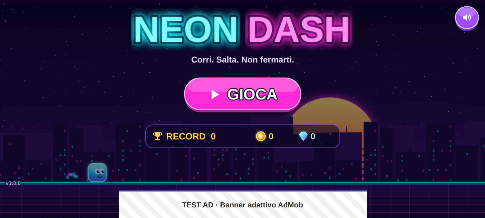
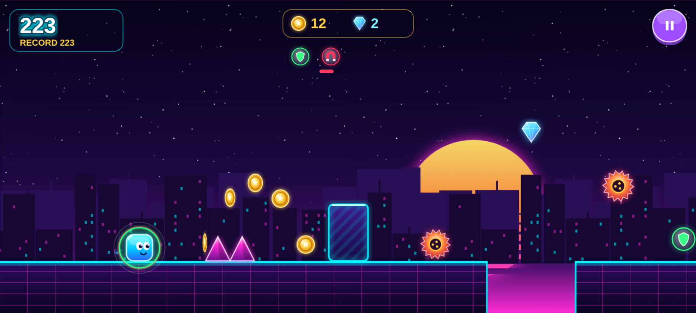
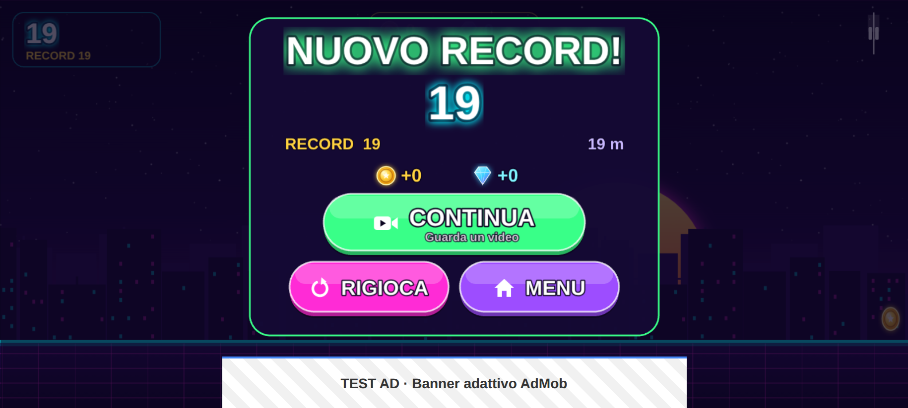

# Neon Dash

Endless runner 2D in stile synthwave per Android, scritto in **HTML5/JavaScript con Phaser 3**, confezionato con **Capacitor 8** e monetizzato con **Google AdMob** (`@capacitor-community/admob`).
Tutta la grafica e tutti i suoni sono generati proceduralmente (Canvas 2D e Web Audio): il gioco non dipende da alcun file di asset esterno.

| Menu | Gioco | Game Over |
| --- | --- | --- |
|  |  |  |

## Scelte di progetto

| Parametro | Valore |
| --- | --- |
| Genere | Endless Runner |
| Meccanica | Il personaggio corre da solo; si salta ostacoli (spine, blocchi, seghe, burroni) raccogliendo monete e gemme; la velocità aumenta col tempo |
| Orientamento | **Landscape** (bloccato in `AndroidManifest.xml` con `sensorLandscape`) |
| Nome app | Neon Dash |
| App ID | `com.clementin0.neondash` (modificabile in `capacitor.config.json`) |

## Gameplay

- **Tocca** per saltare, **tieni premuto** per saltare più in alto, **tocca in aria** per il doppio salto (con coyote time e buffer dell'input per comandi reattivi).
- Ostacoli: spine, blocchi (puoi atterrarci sopra, ma colpirli di lato è fatale), seghe rotanti basse e alte (per quelle alte resta a terra) e burroni.
- I pattern si sbloccano livello dopo livello (uno ogni 15 s) e la velocità sale con una rampa esponenziale da 430 a 1050 px/s. La distanza tra gli ostacoli è calcolata sulla fisica del salto, quindi ogni sequenza è superabile: nei test un bot sopravvive 3 minuti su 8 seed diversi.
- Collezionabili: **monete** (+10), **gemme** (+50, raggiungibili col doppio salto), **scudo** (assorbe un colpo) e **magnete** (attira le monete per 8 s).
- **Punteggio** = metri percorsi + bonus di monete e gemme. **High score**, monete e gemme totali, partite giocate e impostazione audio sono salvati in **LocalStorage**.
- Gameloop completo: Menu principale (con una corsa demo giocata dall'IA sullo sfondo) → Gioco (HUD con punti, record, monete, gemme, power-up e pausa) → Pausa (riprendi con conto alla rovescia, ricomincia, menu, audio) → Game Over (riepilogo, **Continua**, **Rigioca**, **Menu**).
- Tasto indietro di Android: mette in pausa / riprende / torna al menu / esce dall'app. Il gioco va in pausa da solo quando l'app passa in background.

## Monetizzazione (AdMob)

Tutti gli ID sono in un unico file: [`src/config/admob.config.js`](src/config/admob.config.js). In sviluppo si usano gli **ID di test ufficiali di Google**:

| Formato | Dove | Ad Unit ID di test |
| --- | --- | --- |
| App ID | `AndroidManifest.xml` (scritto dallo script) | `ca-app-pub-3940256099942544~3347511713` |
| Banner adattivo | in basso nel **Menu** e nel **Game Over** (nascosto durante il gioco) | `ca-app-pub-3940256099942544/9214589741` |
| Interstitial | ogni **3 partite completate** | `ca-app-pub-3940256099942544/1033173712` |
| Rewarded | pulsante **Continua** nel Game Over: un revive per partita | `ca-app-pub-3940256099942544/5224354917` |

Dettagli di implementazione ([`src/services/AdService.js`](src/services/AdService.js)):

- **Consenso GDPR (UMP)**: prima di inizializzare l'SDK viene raccolto il consenso. Se richiesto, nel menu compare il pulsante privacy.
- **Interstitial**: una partita conta come "completata" quando il giocatore lascia il Game Over (Rigioca o Menu), così l'annuncio non interrompe mai l'offerta di Continua. Se alla terza partita l'annuncio non è ancora caricato, viene mostrato alla partita successiva.
- **Rewarded**: su Android `showRewardVideoAd()` si risolve solo quando la ricompensa viene ottenuta. Per questo il servizio usa gli eventi `Rewarded` e `Dismissed` (con un breve margine per una ricompensa che arriva in ritardo) e un timeout di sicurezza. Il revive viene concesso solo con la ricompensa effettivamente ottenuta: rimuove gli ostacoli vicini, ripristina il terreno, dà 2,5 s di invulnerabilità e fa partire un conto alla rovescia.
- Il layout di Menu e Game Over lascia libero lo spazio del banner, usando l'altezza reale comunicata dall'evento `bannerAdSizeChanged`.
- Durante gli annunci a schermo intero l'audio del gioco va in pausa. Ogni errore dell'SDK viene intercettato e non blocca mai il gioco.
- Nel browser (`npm run dev`) un **mock** ([`MockAdMob.js`](src/services/MockAdMob.js)) simula banner, interstitial e video con ricompensa, così si può provare l'intero flusso senza dispositivo.

## Struttura

```
src/
  config/admob.config.js    ID AdMob (test/produzione) e regole di frequenza
  config/game.config.js     fisica, velocità, punteggi, power-up
  logic/                    simulazione pura (testabile in Node, senza Phaser)
    RunnerWorld.js          scorrimento, fisica, collisioni, pickup, revive
    Spawner.js              pattern di ostacoli e monete
    Difficulty.js           rampa di velocità, livelli, distanze sicure
    ScoreManager.js         punteggio della partita
    Autopilot.js            IA per la demo del menu e i test
  services/                 AdService, MockAdMob, SaveData (LocalStorage), Sfx (Web Audio), Platform (Capacitor App)
  scenes/                   Boot, Menu, Game, Pause, GameOver
  ui/                       texture procedurali, bottoni, HUD, sfondo parallax, renderer del mondo
tests/                      test unitari Vitest
scripts/
  verify-runtime.mjs        test end-to-end nel browser headless
  configure-android.mjs     patch idempotenti del progetto Android
  generate-android-assets.mjs  icone, splash e grafiche per il Play Store
android/                    progetto nativo generato da `npx cap add android`
store/                      icona 512×512 e feature graphic 1024×500 per il Play Store
```

## Comandi

```bash
npm install            # dipendenze
npm run dev            # gioco nel browser con hot reload (annunci simulati)
npm test               # 68 test unitari (logica, punteggio, salvataggi, trigger degli annunci)
npm run build          # bundle web di produzione in dist/
npm run verify         # gioca la build in Chromium headless e verifica tutto il flusso
npm run cap:sync       # build + npx cap sync android + configurazione Android
npm run cap:open       # apre il progetto in Android Studio
```

`npm run verify` emula un telefono in landscape con touch e controlla 20 punti: avvio, banner nel menu, banner nascosto in gioco, salto, punteggio, pausa/ripresa, high score in LocalStorage, revive con video, una sola seconda possibilità per partita, interstitial alla terza partita completata e assenza di errori in console. Gli screenshot finiscono in `verify-output/`.

## Build Android

Requisiti: Node 22+, JDK 21, Android SDK con platform 36 (Android Studio).

```bash
npm run cap:sync
cd android && ./gradlew assembleDebug     # APK in android/app/build/outputs/apk/debug/
```

La GitHub Action [`.github/workflows/android.yml`](.github/workflows/android.yml) esegue test, build, verifica runtime e `assembleDebug` a ogni push, e pubblica l'APK di debug come artifact.

## Pubblicazione sul Play Store

1. Nella console AdMob crea l'app e i tre blocchi di annunci, poi incolla gli ID in `PRODUCTION_IDS` e imposta `USE_TEST_ADS = false` in `src/config/admob.config.js`. Finché gli ID sono segnaposto, il gioco continua a usare quelli di test e `npm run android:configure` si rifiuta di procedere.
2. Configura il messaggio GDPR in AdMob (Privacy e messaggi) e pubblica `app-ads.txt` sul sito dello sviluppatore.
3. `npm run cap:sync`, poi genera l'AAB firmato con Android Studio (*Build → Generate Signed App Bundle*) oppure con `./gradlew bundleRelease` e una signing config.
4. Nella Play Console dichiara che l'app contiene annunci, compila la sezione *Sicurezza dei dati* (l'SDK AdMob raccoglie l'Advertising ID) e indica l'URL della privacy policy.
5. Grafiche pronte in `store/`. Per rigenerare icone e splash: `node scripts/generate-android-assets.mjs`.

## Note tecniche

- Risoluzione base 1280×720 con `Phaser.Scale.EXPAND`: il canvas riempie qualsiasi rapporto d'aspetto (18:9, 20:9, tablet) senza bande nere e l'interfaccia si ancora ai bordi.
- Schermo intero immersivo (barre di sistema nascoste, riapplicato dopo gli annunci) in `MainActivity.java`. Sfondo scuro su splash e finestra, per evitare il flash bianco all'avvio.
- La logica di gioco (`src/logic`) non dipende da Phaser: le scene si limitano a disegnarne lo stato. Per questo fisica, collisioni, punteggio e revive sono coperti da test deterministici in Node.
